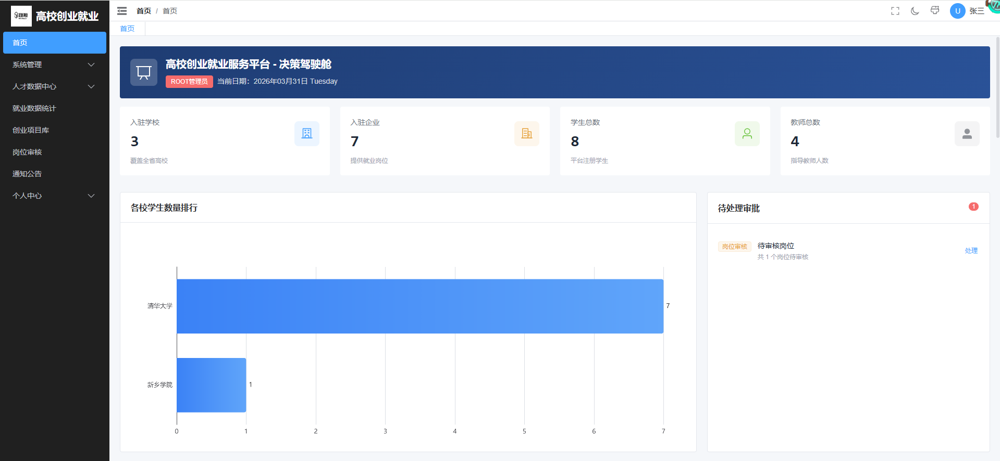
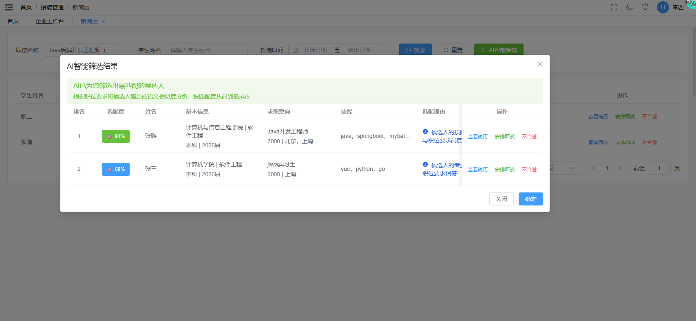
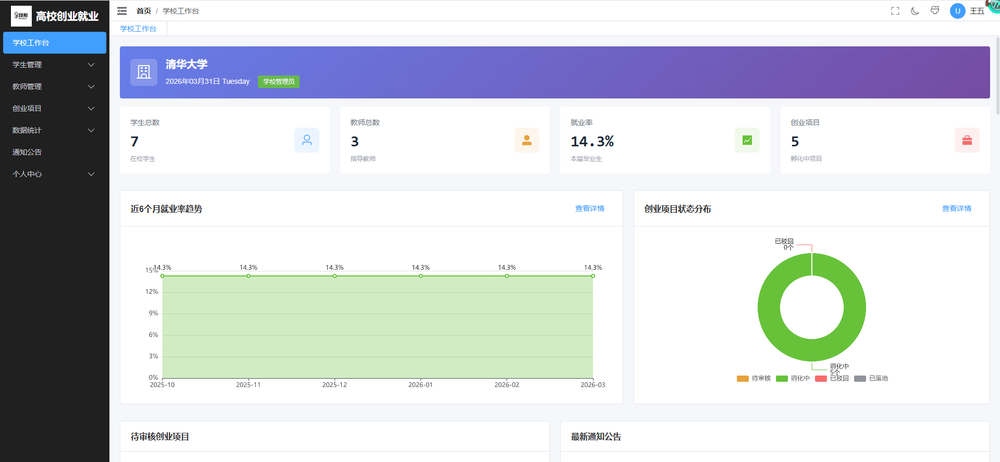
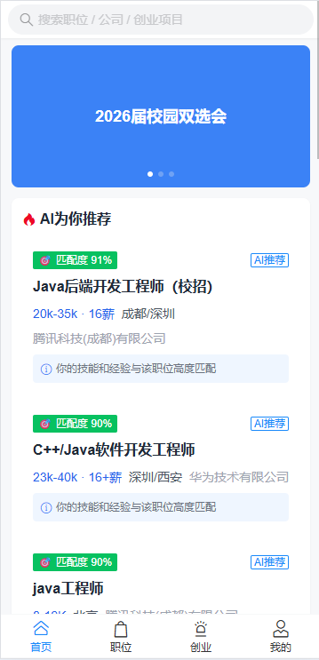

# 🎓 高校创业就业服务平台

<div align="center">
</div>

---

## 📖 项目简介

高校创业就业服务平台是一个基于 Vue 3 + Spring Boot 的前后端分离项目，旨在为高校师生和企业搭建一个便捷的创业就业服务桥梁。系统支持 PC 端和移动端双端访问，提供企业招聘、学生求职、创业项目管理、教师指导等核心功能。

### 🎯 核心价值

- **学生端**：简历管理、职位投递、创业项目发布、教师指导申请
- **企业端**：职位发布、简历筛选、AI智能匹配、面试安排
- **教师端**：项目指导、学生辅导、指导记录管理
- **学校端**：数据统计、学生管理、就业创业分析
- **管理员端**：平台管理、企业审核、数据监控

---

## ✨ 功能特性

### 🏢 企业招聘管理
- ✅ 职位发布与管理
- ✅ 简历投递查看
- ✅ AI智能简历筛选（基于语义相似度分析）
- ✅ 面试安排与通知
- ✅ 人才库管理


### 👨‍🎓 学生求职与创业
- ✅ 在线简历编辑（支持教育经历、实习经历、项目经历）
- ✅ 职位搜索与投递
- ✅ 面试通知查看
- ✅ 创业项目发布与管理
- ✅ 项目阶段管理（未开始/进行中/已完成）
- ✅ 团队成员招募


### 👨‍🏫 教师指导服务
- ✅ 创业项目指导
- ✅ 项目阶段指导记录
- ✅ 学生项目列表查看
- ✅ 指导历史记录


### 🏫 学校管理功能
- ✅ 学生就业数据统计
- ✅ 创业项目数据分析
- ✅ 教师指导情况统计
- ✅ 就业率分析


### 🔧 系统管理功能
- ✅ 企业资质审核
- ✅ 职位审核管理
- ✅ 学校管理
- ✅ 数据字典管理
- ✅ 系统公告发布
- ✅ 数据可视化（ECharts图表）


### 🤖 AI智能功能
- ✅ 基于 pgvector 的向量检索
- ✅ 职位与简历语义相似度匹配
- ✅ 智能推荐候选人
- ✅ 匹配度评分与理由展示

---

## 🛠️ 技术栈

### 前端技术

| 技术 | 版本 | 说明 |
|------|------|------|
| [Vue 3](https://vuejs.org/) | 3.5.22 | 渐进式 JavaScript 框架 |
| [Vite](https://vitejs.dev/) | 7.1.11 | 下一代前端构建工具 |
| [TypeScript](https://www.typescriptlang.org/) | 5.9.0 | JavaScript 的超集 |
| [Element Plus](https://element-plus.org/) | 2.11.7 | PC端UI组件库 |
| [Vant](https://vant-ui.github.io/) | 4.9.22 | 移动端UI组件库 |
| [Pinia](https://pinia.vuejs.org/) | 3.0.3 | Vue 状态管理库 |
| [Vue Router](https://router.vuejs.org/) | 4.6.3 | Vue 官方路由 |
| [Axios](https://axios-http.com/) | 1.13.2 | HTTP 客户端 |
| [ECharts](https://echarts.apache.org/) | 6.0.0 | 数据可视化图表库 |
| [UnoCSS](https://unocss.dev/) | 66.1.0 | 即时原子化CSS引擎 |

### 后端技术（需配合后端项目）

- **框架**：Spring Boot 3.5.x
- **ORM**：MyBatis-Plus
- **数据库**：PostgreSQL（支持 pgvector 扩展）
- **缓存**：Redis
- **分布式锁**：Redisson
- **安全认证**：Spring Security + JWT

---

## 📦 快速开始

### 环境要求

- Node.js >= 22.x
- pnpm >= 10.x

### 安装依赖

```bash
# 克隆项目
git clone https://github.com/your-username/employment-entrepreneurship-web.git

# 进入项目目录
cd employment-entrepreneurship-web

# 安装依赖
pnpm install
```

### 开发环境配置

1. 复制环境变量文件
```bash
cp .env.development.example .env.development
```

2. 修改 `.env.development` 配置后端API地址
```env
VITE_API_BASE_URL=http://localhost:8080
```

### 启动开发服务器

```bash
# 启动开发服务器
pnpm dev

# 访问地址
# PC端：http://localhost:5173
# 移动端：http://localhost:5173/mobile
```

---

## 🎨 系统截图

### PC端界面

#### 管理员端


#### 企业端


#### 学校端
  


### 移动端界面

#### 学生端


#### 教师端


---

## 🔐 用户角色说明

| 角色 | 权限说明 | 主要功能 |
|------|---------|---------|
| 系统管理员 | 最高权限 | 企业审核、学校管理、数据统计、系统配置 |
| 学校管理员 | 学校范围 | 学生管理、教师管理、就业数据统计 |
| 企业HR | 企业范围 | 职位发布、简历筛选、面试安排 |
| 教师 | 指导权限 | 项目指导、学生辅导 |
| 学生 | 个人权限 | 简历管理、职位投递、项目创建 |

---

## 🚀 核心功能实现

### AI智能简历筛选

基于 PostgreSQL 的 pgvector 扩展实现向量检索，通过语义相似度分析匹配职位与简历：

1. 将职位描述和简历内容转换为向量
2. 使用余弦相似度计算匹配度
3. 按匹配度排序返回推荐候选人
4. 提供匹配理由和评分

### 分布式锁应用场景

使用 Redisson 实现分布式锁，解决高并发场景下的数据一致性问题：

- 学生投递简历（防止重复投递）
- 企业面试安排（防止时间冲突）
- 项目成员申请（控制团队人数上限）
- 项目阶段状态更新（保证状态流转正确性）

### 响应式设计

- PC端使用 Element Plus 组件库
- 移动端使用 Vant 组件库
- 通过路由区分不同端的页面
- 统一的API接口层


</div>
